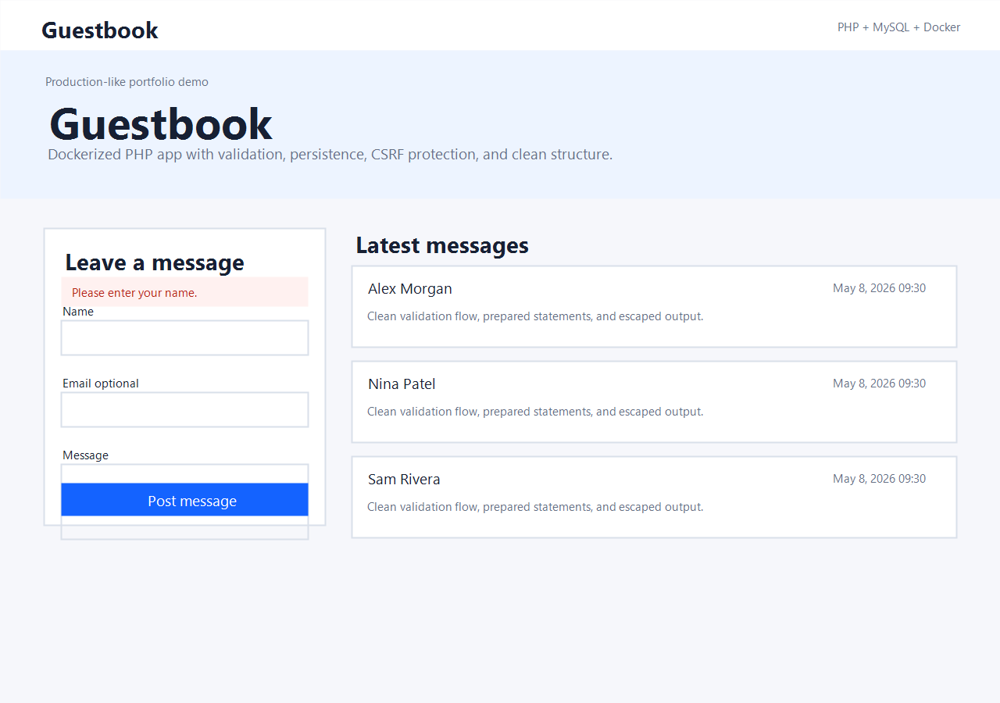
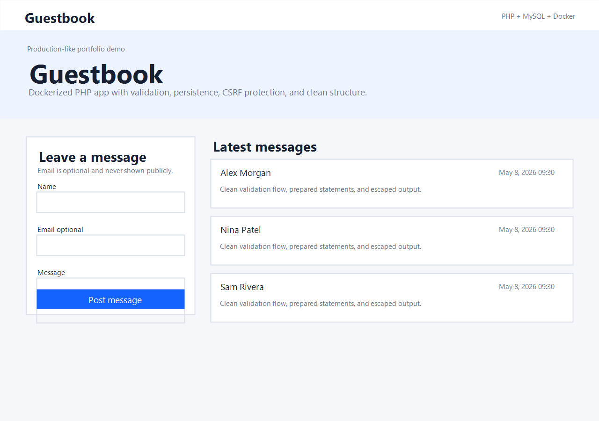
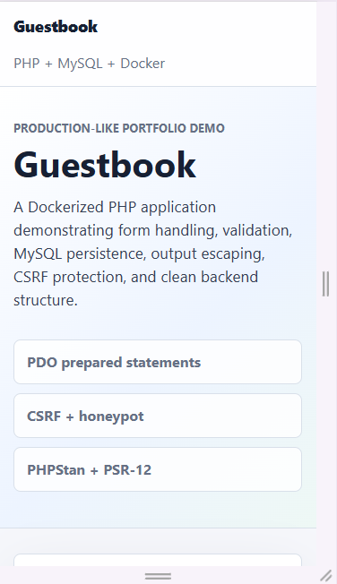

# Guestbook


A Dockerized PHP guestbook application demonstrating form handling, validation, database persistence, and clean project structure.

## Overview

Guestbook is a production-like portfolio project focused on backend fundamentals: request handling, input validation, MySQL persistence, safe output rendering, Docker-based local setup, and code quality tooling. The UI is intentionally simple and polished so the backend behavior is easy to evaluate.

## Features

- Guestbook form with required name and message fields.
- Optional email field with validation.
- Friendly validation and persistence errors.
- Latest messages shown first with creation date.
- MySQL persistence through PDO prepared statements.
- CSRF token validation and honeypot spam protection.
- Escaped output in views.
- Responsive layout with accessible labels and visible focus states.

## Tech Stack

- PHP 8.2
- MySQL 8.0
- PDO
- AltoRouter
- Docker Compose
- phpMyAdmin
- PHP_CodeSniffer with PSR-12
- PHPStan
- Custom CSS
- PHPUnit

## Screenshots






## Installation

```bash
composer install
cp .env.example .env
```

On Windows PowerShell:

```powershell
Copy-Item .env.example .env
composer install
```

## Docker Setup

```bash
cp .env.example .env
docker compose up -d --build
```

- Application: `http://localhost:8000`
- phpMyAdmin: `http://localhost:8080`
- MySQL forwarded port: `3307`

The Docker services read database credentials from `.env.example` defaults after you copy it to `.env`.

## Environment Variables

| Variable | Purpose | Default |
| --- | --- | --- |
| `APP_ENV` | Application environment | `local` |
| `APP_URL` | Local app URL | `http://localhost:8000` |
| `APP_PORT` | Host port for Apache/PHP | `8000` |
| `DB_HOST` | Host used by local PHP outside Docker | `127.0.0.1` |
| `DB_PORT` | Local MySQL port outside Docker | `3307` |
| `DB_FORWARD_PORT` | Host port mapped to MySQL container | `3307` |
| `DB_DATABASE` | Database name | `appdb` |
| `DB_USERNAME` | Database user | `appuser` |
| `DB_PASSWORD` | Database password | `apppass` |
| `DB_ROOT_PASSWORD` | MySQL root password for Docker | `rootpass` |
| `PHPMYADMIN_PORT` | Host port for phpMyAdmin | `8080` |

## Database Import

The schema is imported automatically on the first MySQL container startup from `app.sql`.

Manual import, which recreates the `guestbook_entries` table and loads demo seed data:

```bash
docker compose exec -T mysql mysql -uappuser -papppass appdb < app.sql
```

Recreate tables from a clean Docker volume:

```bash
docker compose down -v
docker compose up -d --build
```

Check the connection:

```bash
docker compose exec mysql mysqladmin ping -h 127.0.0.1 -prootpass
```

## Developer Scripts

```bash
composer cs
composer cs:fix
composer test
composer stan
```

## Architecture Notes

- `index.php` boots configuration and dispatches routes through AltoRouter.
- `config/database.php` maps environment variables into database connection settings.
- `app\models\Database` creates a safe PDO connection with exceptions and prepared statements enabled.
- `src/Factory/ApplicationFactory.php` wires application dependencies in one place.
- `src/controllers` handles HTTP flow and delegates persistence, validation, CSRF, and flash concerns.
- `src/Repository/GuestbookRepository.php` owns SQL queries and prepared statements.
- `src/Validator/GuestbookEntryValidator.php` owns input validation and trimming.
- `src/Service/CsrfTokenService.php` and `src/Service/FlashBag.php` handle session-based concerns.
- `src/views` contains presentation templates only.

## Security Notes

- `.env` is ignored and should never be committed.
- `.env.example` contains demo-only local credentials.
- User input is trimmed and validated before persistence.
- Output is escaped with `htmlspecialchars`.
- SQL uses PDO prepared statements.
- The submit form includes CSRF protection and a honeypot field.
- This repository previously tracked a demo `.env` file and a demo password hash in `app.sql`; both have been removed from the current tree. Treat the project as demo-only and rotate any copied secrets before real use.

## Code Quality

CI runs Composer install, PHP syntax checks, PSR-12 checks, PHPUnit tests, and PHPStan static analysis.

## Possible Future Improvements

- Pagination.
- Admin moderation.
- Authentication.
- Edit/delete messages.
- REST API endpoint.
- More integration tests around the database and HTTP flow.
- Rate limiting.
- Docker production profile.

## GitHub Repository Metadata

Suggested About description:

```text
Dockerized PHP guestbook application demonstrating form handling, validation, MySQL persistence, and clean backend architecture.
```

Suggested topics:

```text
php, mysql, docker, guestbook, backend, form-validation, phpstan, psr-12, scss, javascript, portfolio-project, web-application
```

Suggested release: `v1.0.0`.

## License

MIT License. See [LICENSE](LICENSE).
